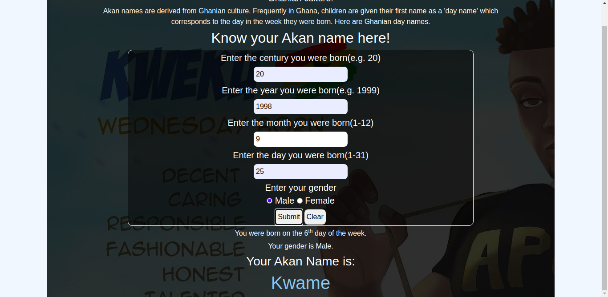

# akan name

# landing page.

### Author name: Humphrey mutuma.

#### Project description:
This is a responsive, mobile first, webpage, showing Akan names from the Ghanian culture;

Frequently in Ghana, children are given their first name as a 'day name' which corresponds to the day in the week they were born. Here are Ghanian day names.

#### Male Akan names are shown below;
- Sunday: Kwasi
- Monday: Kwadwo
- Tuesday: Kwabena
- Wednesday: Kwaku
- Thursday:  Yaw
- Friday: Kofi
- Saturday: Kwame

#### Female Akan names are shown below;
- Sunday: Akosua
- Monday: Adwoa
- Tuesday: Abenaa
- Wednesday: Akua
- Thursday:  Yaa
- Friday: Afua
- Saturday: Ama

Project setup instructions: You can fork this projects from GitHub.
# BDD

| Inputs  | Description  |
|---|---|
|Century  | The century that the user was born in, eg 20th  |
| Year  | The year of the century eg 98th year  |
| Month  |  The month of the year eg 7th month |
| Date  | The day of the month eg 15th day |

| Output  | Description  |
|---|---|
|Day   | The day of the week you were born .eg 5th|
| Gender  | Your gender, either male or female. |
| Akan name  |  Your Akan name, highlighted in blue. |
	
### Technologies used;
> HTML

> CSS

>Bootstrap

>JavaScript

>Markdown

 ### Development
Want to contribute? Great!

To fix a bug or enhance an existing module, follow these steps:

- Fork the repo

- Create a new branch (git checkout -b improve-feature)

- Make the appropriate changes in the files

- Add changes to reflect the changes made

- Commit your changes (git commit -am 'Improve feature')

- Push to the branch (git push origin improve-feature)

- Create a Pull Request

#### Demo : 
Here is the link to live demo [Click me](https://humphrey-mutuma.github.io/akan-name/)

Copyright and license information: This project is licensed under the terms of the MIT license.
